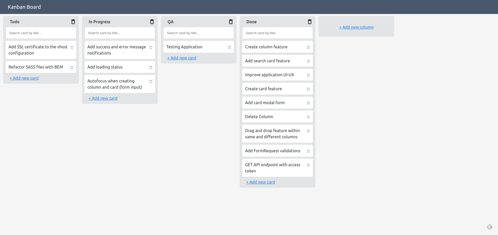

# Kanban Dashboard

## Project Scope
The current project aims to create an open-source Kanban Dashboard with some of the most common features included.

## Structure
- api: Laravel 9 application serving a GraphQL endpoint
- app: Nuxt 3 application serving frontend

## Task List
- [ ] Refactor application code with TailwindCSS
- [ ] Introduce GraphQL instead of the REST API
- [ ] Migrate to Nuxt framework(v3)

## Screenshot

