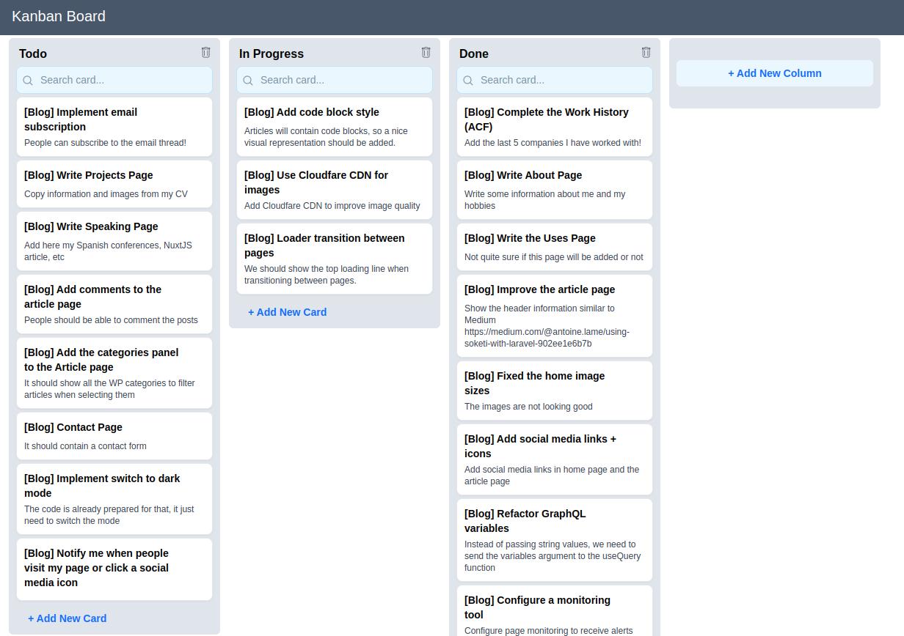

  Kanban Dashboard

  An open-source Kanban Dashboard with some of the most common features included.

------

**Demo**: https://kanbandash.com/

**Status Page**: https://status.kanbandash.com/

**Docs [WIP]**: https://docs.kanbandash.com/

## Tech Stack
- Laravel v9
- Nuxt v3
- VueJS 3
- GraphQL
- TailwindCSS

## Structure
- **api** folder: Laravel 9 application serving a GraphQL endpoint
- **app** folder: Nuxt 3 application serving frontend
- **docs** folder: Nuxt Docus serving project documentation

## Development Tasks
- [ ] Create documentation site using Nuxt docs package
- [x] Refactor application code with TailwindCSS
- [x] Refactor application code with Pinia(store management)
- [x] Introduce GraphQL instead of the REST API
- [x] Migrate to Nuxt framework(v3)
- [x] Add new icon library(nuxt-icon)
- [x] Introduce Tailwind Components
- [x] Migrate to multi-tenant database
- [x] Add register page
- [ ] Delete cards
- [ ] Add login page
- [x] Add multiple dashboards
- [ ] Protect API with token
- [ ] Add dashboard filters(date, status, etc)
- [ ] Add assigned users
- [ ] Upload attachments
- [ ] Add checklist items
- [x] Build homepage (domain input redirects to account subdomain)

## Test Coverage
- [ ] Unit tests
- [ ] E2E tests using Laravel Dusk
- [ ] Frontend unit tests

## DevOps Tasks
- [x] Configure monitoring tools(Sentry, Datadog, Better Uptime)
- [ ] Activate OPCache
- [ ] PHP-FPM restart should not be needed
- [x] Cloudflare CDN
- [x] Register should create a new DO subdomain
- [ ] Add source maps to Sentry for better traceability

## Screenshot

